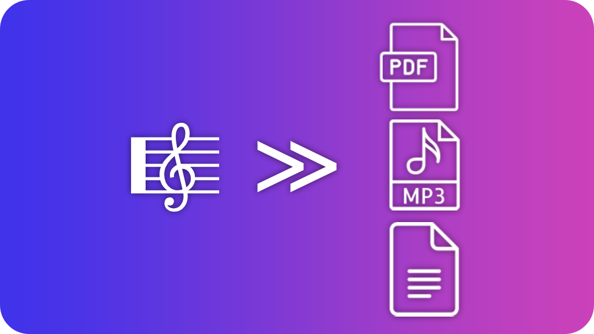

<p align="center">
  
</p>

<p align="center">
  <a href="https://github.com/aserpiq/musescore-multiple-export/releases"></a>&nbsp;&nbsp;
  <a href="https://github.com/aserpiq/musescore-multiple-export/actions/workflows/validate.yml"></a>&nbsp;&nbsp;
  <a href="https://github.com/aserpiq/musescore-multiple-export/releases"></a>&nbsp;&nbsp;
  <a href="https://github.com/aserpiq/musescore-multiple-export/stargazers"></a>&nbsp;&nbsp;
  <a href="LICENSE"></a>&nbsp;&nbsp;
  
</p>

# Multiple Export

A small MuseScore 4 plugin to export the current score to several formats at once.

I made it because I was tired of doing the same thing over and over again:

`File → Export → PDF`
then MP3, then MIDI, then MusicXML...

With this plugin I can select everything I need once and export it from a single window ^^

<br>

<p align="center">
  <a href="https://github.com/aserpiq/musescore-multiple-export/releases/latest">
    <strong>Download the latest release</strong>
  </a>
</p>

<br>

## What it does

Multiple Export lets you choose an export folder and generate several formats in one go.

Supported formats:

* PDF
* PNG
* SVG
* MP3
* WAV
* FLAC
* OGG
* MIDI
* MusicXML
* MXL
* MEI
* Braille (`.brf`)

The plugin remembers the folder and selected formats for each score, so you don't have to configure everything again every time you open it.

You can still change the selection before each export.

## Format options

Some formats also have an **Options...** button.

At the moment:

### MP3

You can choose the bitrate:

* 96 kbps
* 128 kbps
* 160 kbps
* 192 kbps
* 224 kbps
* 256 kbps
* 320 kbps

### PNG

You can change:

* DPI
* whitespace trimming
* trim margin

### SVG

You can change:

* whitespace trimming
* trim margin

The other formats use MuseScore's normal export settings.

This is mostly a limitation of the MuseScore plugin API: not every export setting can be changed independently by a plugin.

## Installation

Download `MultipleExport.qml` and put it in your MuseScore 4 plugins folder.

On Windows, this is usually:

```text
C:\Users\<username>\Documents\MuseScore4\Plugins\
```

Then restart MuseScore and enable **Multiple export** from the Plugin Manager.

I personally use a keyboard shortcut for it:

```text
Ctrl + Shift + E
```

## Usage

Open a score and run **Multiple export**.

You'll get a small window where you can:

* choose the export folder;
* select the formats you want;
* configure options for supported formats;
* export everything.

The plugin stores its configuration inside the score itself, so different projects can have different export setups.

For example, one score might usually export:

```text
PDF
MP3
MIDI
MusicXML
```

while another one only needs:

```text
PDF
WAV
```

The last configuration used for a score is loaded automatically the next time you run the plugin.

## Progress window

When exporting, the plugin shows a small progress window with the format currently being processed.

Some MuseScore export functions are synchronous, especially audio rendering, so MuseScore may temporarily look frozen while exporting a large MP3 or WAV file.

It's not ideal, but it's a limitation of the current MuseScore plugin API rather than the plugin doing nothing in the background.

## Custom export options

MuseScore's `writeScore()` API doesn't allow passing export settings such as MP3 bitrate directly.

For the few options MuseScore exposes through its command-line converter, the plugin uses MuseScore itself as the converter.

Currently this is used for:

* MP3 bitrate
* PNG DPI / trim
* SVG trim

No external encoder or conversion program is required.

## Requirements

Currently tested with:

* MuseScore Studio 4.7.x
* Windows 10 / 11

At the moment I consider Windows the supported platform.

The basic export system is fairly platform-independent, but some of the custom export-option handling currently relies on Windows-specific behaviour.

## Known limitations

* Only MP3, PNG and SVG currently have per-export options.
* Large audio exports can temporarily block the MuseScore UI.
* macOS and Linux haven't been tested yet.
* MuseScore's plugin API is still fairly limited compared with the application's internal export system.

## Project metadata

The plugin stores its settings in the score metadata using:

```text
exportPath
exportFormats
exportOptions
```

You normally don't need to touch these manually.

## Bugs

If something breaks, opening an issue with the following information will help a lot:

* MuseScore version
* Windows version
* formats you were exporting
* whether you were using **Options...**
* relevant lines from the MuseScore log

## License

MIT
